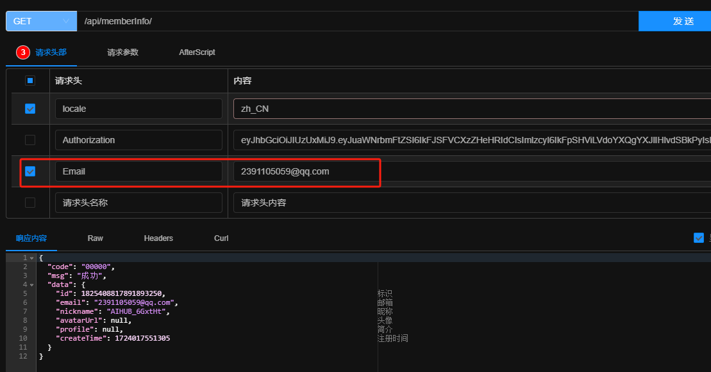

# AiHub Server

## 技术栈

代码语言：JDK17

Web 框架：SP3

数据库：Mysql8

缓存：Redis(最新版)

## 接口统一响应结构

| key  | type         | comment                                                |
| ---- | ------------ | ------------------------------------------------------ |
| code | string       | 成功 code - 00000，失败 code - 00001，其余的看业务情况 |
| msg  | string       | 消息                                                   |
| data | Object/Array | 返回的数据，没有的情况下为 NULL                        |

## 接口文档

基于 knife4j 进行搭建，启动项目后访问 `/doc.html` 地址即可

## 国际化参数配置

在 request header 里添加 key 为  `locale` 的属性即可，目前只支持两种：**zh_CN**, **en_US**

## 认证服务

采用 RefreshToken + AccessToken 的结构，前者用来刷新后者，后者用来访问资源

### 用户登录

访问 `/api/auth/` 下的相关服务，登录成功后的返回的 data 属性字段为以下结构：

| key          | type   | comment                                                      |
| ------------ | ------ | ------------------------------------------------------------ |
| refreshToken | string | 用来刷新 accessToken 的 token                                |
| accessToken  | string | 用来访问资源的 token                                         |
| expired      | long   | refreshToken 的过期时间，时间戳，Server 端已处理好，超过该时间重新登录即可 |

### 刷新  AccessToken

通过传入请求头参数 key 为 **RefreshCert**，value 为 **RefreshToken**(登录是分发的)的值，就可以刷新 AccessToken

具体的参数细节可以看接口文档中 `/api/auth/refreshToken` 接口

### Dev 环境下自动填充 AccessToken

> 该项功能只在 dev 环境下生效，主要是针对 Server 调试接口每次要获取 AccessToken 过于麻烦了

通过传入请求头参数 key 为 **Email**，value 为目标用户对象的邮箱即可

